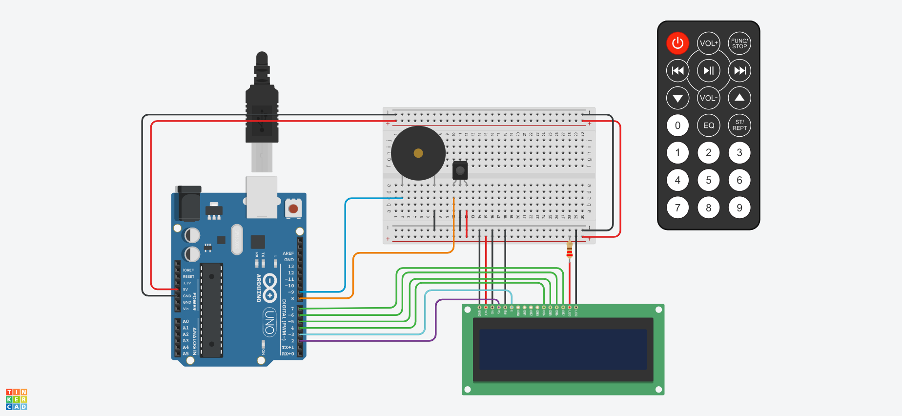

# Arduino IR Remote

Arduino Uno with an infrared sensor connected to a LCD. It will display which button was pressed in the remote control

# Components

* 1 Arduino Uno R3
* 1 LCD 16 x 2
* 1 IR Sensor
* 1 IR Remote Control

# Circuit

Each time a button from the remote control is pressed, it will be showed in the LCD

# Code

The code for Arduino can be found in the `src` directory. It's just a single file written in `C`.

# Simulation

[watch how it works in tinkercad](https://www.tinkercad.com/things/h9rLoVvLoWN)
